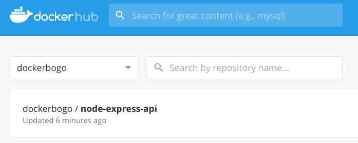
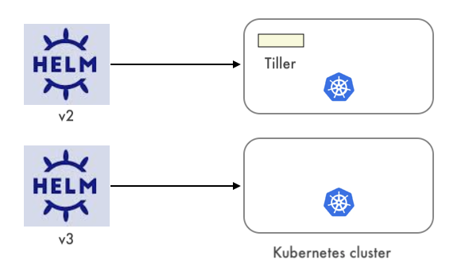
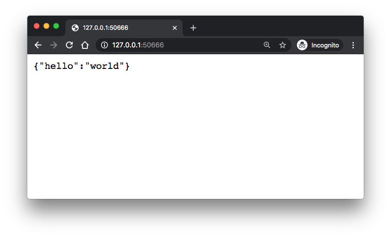
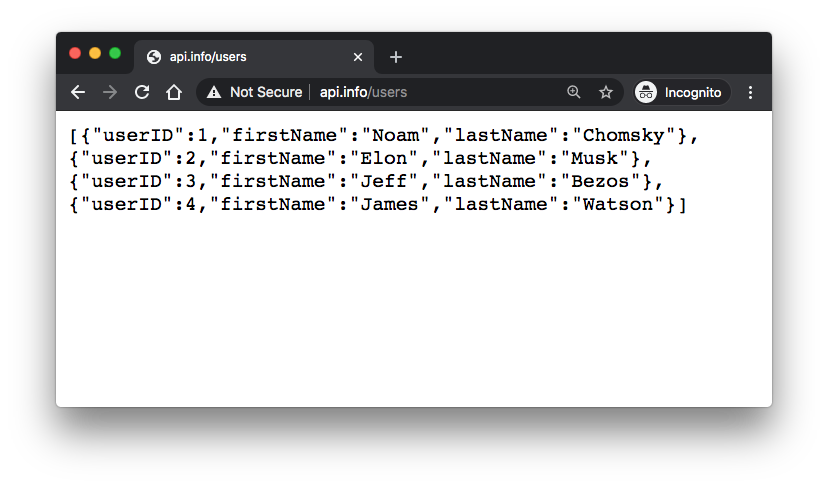

# [k8s-node-express-mysql-api-deploy-via-helm](https://www.bogotobogo.com/DevOps/Docker/Docker_Helm_Chart_Node_Expess_MySQL_Ingress.php)


## Introduction

In this post, on Minikube, using Helm v.2, we'll deploy Nodejs and Express hello world app with Ingress and then later we will add MySQL to our Kubernetes cluster.

The codes are available https://github.com/Einsteinish/k8s-node-express-mysql-api-deploy-via-helm


## Node/Express app

We'll build a simple "Hello, world" API using Node.js and Express. Let's make a new api directory, initialize npm, and then install express:
```
$ npm install -g yarn 
/usr/local/bin/yarnpkg -> /usr/local/lib/node_modules/yarn/bin/yarn.js
/usr/local/bin/yarn -> /usr/local/lib/node_modules/yarn/bin/yarn.js
+ yarn@1.22.5

$ mkdir api 

$ cd api 

$ yarn init 
yarn init v1.22.5
question name (api): 
question version (1.0.0): 
question description: 
question entry point (index.js): 
question repository url: 
question author: 
question license (MIT): 
question private: 
success Saved package.json
Done in 25.57s.

$ yarn add express forever   
yarn add v1.22.5
...
```

**app.js:**
```
async function main() {
  const express  = require('express');
  const app      = express();
  const port     = 3000;
  app.get('/', (req, res) => res.json({hello: 'world'}));
  await app.listen(port);
  console.log(`Listening on port ${port}.`);
}
main();    
```

If we run node app and then connect to http://localhost:3000 we should see a {"hello":"world"} response:
```
$ node app
Listening on port 3000.
```


## Dockerfile for the app

In the following Dockerfile, we copy the contents of the api folder into an image and installs npm dependencies. When the image is utilized, the command forever app.js will be issued, running the app on the exposed port, **3000**:
```
FROM node:dubnium-alpine
WORKDIR /var/www/node/api
COPY ./ ./
RUN npm install -g yarn forever --force && \
  yarn install --production --force
USER node
EXPOSE 3000
CMD ["forever", "app.js"]
```

**.dockerignore:**
```
node_modules
npm-debug.log    
```

Let's build the image:
```
$ docker build -t node-express-api .
...
Successfully built 550e3bcfc98e
Successfully tagged node-express-api:latest

$ docker images
REPOSITORY                                TAG                 IMAGE ID            CREATED             SIZE
node-express-api                          latest              550e3bcfc98e        15 minutes ago      138MB
```

Then tag and push the image to a container repository.
```
$ docker tag node-express-api:latest dockerbogo/node-express-api:1.0.0
    
$ docker login -u dockerbogo
Password: 
Login Succeeded
    
$ docker push dockerbogo/node-express-api:1.0.0    
```



Push the files into git:
```
$ git add api
$ git commit -m "initial commit"
$ git remote add origin https://github.com/Einsteinish/k8s-node-express-mysql-api-deploy-via-helm.git
$ git tag v1.0.0
$ git push origin master --tag    
```

So, the source is in here: https://github.com/Einsteinish/k8s-node-express-mysql-api-deploy-via-helm/releases/tag/v1.0.0


## Minikube and Helm

We'll deploy our app to Minikube:
```
$ minikube start --vm=true
minikube v1.13.0 on Darwin 10.13.3
KUBECONFIG=/Users/kihyuckhong/.kube/config
sing the hyperkit driver based on existing profile
Starting control plane node minikube in cluster minikube
Updating the running hyperkit "minikube" VM ...
Preparing Kubernetes v1.19.0 on Docker 19.03.12 ...
Verifying Kubernetes components...
Verifying ingress addon...
Enabled addons: default-storageclass, ingress, storage-provisioner
Done! kubectl is now configured to use "minikube" by default

$ kubectl config view
apiVersion: v1
clusters:
- cluster:
    certificate-authority: /Users/kihyuckhong/.minikube/ca.crt
    server: https://192.168.64.8:8443
  name: minikube
contexts:
- context:
    cluster: minikube
    user: minikube
  name: minikube
current-context: minikube
kind: Config
preferences: {}
users:
- name: minikube
  user:
    client-certificate: /Users/kihyuckhong/.minikube/profiles/minikube/client.crt
    client-key: /Users/kihyuckhong/.minikube/profiles/minikube/client.key
```

kubernetes and its package manager, Helm, let us describe and version the state of a system in a Helm Chart, and then deploy that chart to a local (such as Minikube) or cloud-based server cluster.

Note that we'll use Helm v.2:

```
$ ls -l $(which helm)
lrwxr-xr-x  1 root  admin  30 Sep  6 14:37 /usr/local/bin/helm -> /usr/local/opt/helm@2/bin/helm

$ ls -l $(which helm3)
lrwxr-xr-x  1 kihyuckhong  admin  29 Sep  6 14:24 /usr/local/bin/helm3 -> ../Cellar/helm/3.3.1/bin/helm

$ helm version
Client: &version.Version{SemVer:"v2.16.10", GitCommit:"bceca24a91639f045f22ab0f41e47589a932cf5e", GitTreeState:"clean"}
Error: could not find tiller
```

We need to initialize Helm by adding the Helm server, Tiller, to our local cluster:

```
$ kubectl get pods -n kube-system
NAME                               READY   STATUS    RESTARTS   AGE
coredns-f9fd979d6-258nf            1/1     Running   0          2m06s
etcd-minikube                      1/1     Running   0          2m10s
kube-apiserver-minikube            1/1     Running   0          2m10s
kube-controller-manager-minikube   1/1     Running   0          2m10s
kube-proxy-lzblz                   1/1     Running   0          2m10s
kube-scheduler-minikube            1/1     Running   0          2m10s
storage-provisioner                1/1     Running   0          2m10s

$ helm init
$HELM_HOME has been configured at /Users/kihyuckhong/.helm.

Tiller (the Helm server-side component) has been installed into your Kubernetes Cluster.
...

$ kubectl get pods -n kube-system
NAME                               READY   STATUS              RESTARTS   AGE
coredns-f9fd979d6-258nf            1/1     Running   0          2m16s
etcd-minikube                      1/1     Running   0          2m20s
kube-apiserver-minikube            1/1     Running   0          2m20s
kube-controller-manager-minikube   1/1     Running   0          2m20s
kube-proxy-lzblz                   1/1     Running   0          2m16s
kube-scheduler-minikube            1/1     Running   0          2m20s
storage-provisioner                1/1     Running   0          2m20s
tiller-deploy-6fd89dcdc6-2tnrf     1/1     Running   0          85s

$ helm version
Client: &version.Version{SemVer:"v2.16.10", GitCommit:"bceca24a91639f045f22ab0f41e47589a932cf5e", GitTreeState:"clean"}
Server: &version.Version{SemVer:"v2.16.10", GitCommit:"bceca24a91639f045f22ab0f41e47589a932cf5e", GitTreeState:"clean"}
```


## Create a Helm chart

Let's start with Helm's chart generator:

```
$ helm create api-deploy
Creating node-mysql
~/Documents/TEST/Minikube/HELM/TEST $ tree api-deploy
api-deploy
├── Chart.yaml
├── charts
├── templates
│   ├── NOTES.txt
│   ├── _helpers.tpl
│   ├── deployment.yaml
│   ├── hpa.yaml
│   ├── ingress.yaml
│   ├── service.yaml
│   ├── serviceaccount.yaml
│   └── tests
│     └── test-connection.yaml
└── values.yaml

3 directories, 10 files
```

We need to define the values that Helm will pass to our templates such as the Docker image tag and the number of replicas. **api-deploy/values.yaml**:

```
replicaCount: 1

image:
  tag: latest    
```

**api-deploy/Chart.yaml** file has some information about the Helm chart, such as the chart's version, name, and description:

```
apiVersion: v1
version: 1.0.0
description: A Helm chart for the api.
name: api-deploy    
```

**api-deploy/templates/deployment.yaml**:

```
apiVersion: apps/v1
kind: Deployment
metadata:
  name: api-deployment
  labels:
    app.kubernetes.io/name: node-express-api
    app.kubernetes.io/instance: {{ .Release.Name }}
    app.kubernetes.io/version: {{ .Values.image.tag }}
    app.kubernetes.io/component: node-express-api
    app.kubernetes.io/part-of: node-express-api
    app.kubernetes.io/managed-by: helm2
spec:
  replicas: {{ .Values.replicaCount }}
  selector:
    matchLabels:
      app.kubernetes.io/name: node-express-api
      app.kubernetes.io/instance: {{ .Release.Name }}
  template:
    metadata:
      labels:
        app.kubernetes.io/name: node-express-api
        app.kubernetes.io/instance: {{ .Release.Name }}
    spec:
      containers:
      - name: node-express-api
        image: dockerbogo/node-express-api:{{ .Values.image.tag }}
        ports:
        - containerPort: 3000
          name: http
        readinessProbe:
          httpGet:
            path: /
            port: 3000
          initialDelaySeconds: 1
          periodSeconds: 1
        livenessProbe:
          httpGet:
            path: /
            port: 3000
          initialDelaySeconds: 1
          periodSeconds: 5    
```

The deployment defines a ReplicaSet. The number of pods created is defined by the spec.replicas, and the name of the resulting pods will be based on the name.

Note that some variables are used such as {{ .Values.image.tag }} which allows us to add dynamic content to manifest files. Note also that we're using our Docker image, dockerbogo/node-express-api, which exposes the API on port 3000.

Now we need to expose the API so that we can get external traffic into our cluster via a NodePort service type. This will make Kubernetes to allocate and assign a port to each node, and incoming traffic on that port will be proxied to our API service. We need to populate api/templates/service.yaml with the following:

```
kind: Service
apiVersion: v1
metadata:
  name: api-service
  labels:
    app.kubernetes.io/name: node-express-api
    app.kubernetes.io/instance: {{ .Release.Name }}
    app.kubernetes.io/version: {{ .Values.image.tag }}
    app.kubernetes.io/component: node-express-api
    app.kubernetes.io/part-of: node-express-api
    app.kubernetes.io/managed-by: helm2
spec:
  selector:
    app.kubernetes.io/name: node-express-api
    app.kubernetes.io/instance: {{ .Release.Name }}
  ports:
  - protocol: TCP
    port: 80
    targetPort: 3000
  type: NodePort    
```

The spec.selector defines which pods this NodePort should target, and spec.ports says that incoming traffic on port 80 should target port 3000 on the matched pods. Note that Kubernetes will assign a virtual IP to the service, known as a ClusterIP, and allocate a high-number port that each node will proxy to the service. That is, once deployed we'll be able to access the API externally using an IP and port that k8s assigns.

Update git:

```
$ git add api-deploy
$ git commit -m "helm chart"
[master 391cf0c] helm chart
 5 files changed, 95 insertions(+)
 create mode 100644 api-deploy/.helmignore
 create mode 100644 api-deploy/Chart.yaml
 create mode 100644 api-deploy/templates/deployment.yaml
 create mode 100644 api-deploy/templates/service.yaml
 create mode 100644 api-deploy/values.yaml
$ git tag v1.1.0
$ git push origin master --tag     
```


## Install the chart - deploy the app

Now that our deployment and service defined, we can install the chart using Helm.

```
$ docker tag node-express-api:latest dockerbogo/node-express-api:1.1.0

$ docker push dockerbogo/node-express-api:1.1.0
The push refers to repository [docker.io/dockerbogo/node-express-api] 
```   

Let's deploy it using the newly-created Docker image, 1.1.0, with 2 replicas:

```
$ helm install --name=node-express-api ./api-deploy --set replicaCount=2,image.tag=1.1.0    
NAME:   node-express-api
LAST DEPLOYED: Mon Sep  7 17:22:54 2020
NAMESPACE: default
STATUS: DEPLOYED

RESOURCES:
==> v1/Deployment
NAME            READY  UP-TO-DATE  AVAILABLE  AGE
api-deployment  0/2    2           0          0s

==> v1/Pod(related)
NAME                            READY  STATUS             RESTARTS  AGE
api-deployment-c5ff48777-glmdk  0/1    ContainerCreating  0         0s
api-deployment-c5ff48777-w8885  0/1    ContainerCreating  0         0s

==> v1/Service
NAME         TYPE      CLUSTER-IP   EXTERNAL-IP  PORT(S)       AGE
api-service  NodePort  10.96.69.62  <none>       80:31886/TCP  0s

$ kubectl get all 
NAME                                 READY   STATUS    RESTARTS   AGE
pod/api-deployment-c5ff48777-glmdk   1/1     Running   0          83s
pod/api-deployment-c5ff48777-w8885   1/1     Running   0          83s

NAME                  TYPE        CLUSTER-IP    EXTERNAL-IP   PORT(S)        AGE
service/api-service   NodePort    10.96.69.62   <none>        80:31886/TCP   83s
service/kubernetes    ClusterIP   10.96.0.1     <none>        443/TCP        125m

NAME                             READY   UP-TO-DATE   AVAILABLE   AGE
deployment.apps/api-deployment   2/2     2            2           83s

NAME                                       DESIRED   CURRENT   READY   AGE
replicaset.apps/api-deployment-c5ff48777   2         2         2       83s

$ kubectl rollout status deployment.v1.apps/api-deployment 
deployment "api-deployment" successfully rolled out
```


## Connecting to the service

Kubernetes allocates a high-value port that our nodes will proxy to our service:

$ kubectl get svc
NAME          TYPE        CLUSTER-IP    EXTERNAL-IP   PORT(S)        AGE
api-service   NodePort    10.96.69.62   <none>        80:31886/TCP   8m55s
kubernetes    ClusterIP   10.96.0.1     <none>        443/TCP        132m    


We can connect to the service via a browser by issuing the command minikube service api-service. The url is our cluster's IP (minikube ip) combined with the proxy port that Kubernetes allocated:

$ minikube service api-service
|-----------|-------------|-------------|-------------------------|
| NAMESPACE |    NAME     | TARGET PORT |           URL           |
|-----------|-------------|-------------|-------------------------|
| default   | api-service |          80 | http://172.17.0.3:31886 |
|-----------|-------------|-------------|-------------------------|
Starting tunnel for service api-service.
|-----------|-------------|-------------|------------------------|
| NAMESPACE |    NAME     | TARGET PORT |          URL           |
|-----------|-------------|-------------|------------------------|
| default   | api-service |             | http://127.0.0.1:50666 |
|-----------|-------------|-------------|------------------------|
Opening service default/api-service in default browser...
ecause you are using a Docker driver on darwin, the terminal needs to be open to run it.  
...




## Ingress

In the previous section, we were connecting to our API on ephemeral port. However, it's not desired and we should be able to connect to our API on port 80.

We'll use an ingress resource to manage external access. An ingress resource defines rules that allow inbound connections to access the services within the cluster. Those rules require an ingress controller to be running inside the cluster.

Minikube, by default, uses the ingress-nginx controller which is the one we're going to use. Since it's Minikube's default, we could use it implicitly by enabling the ingress addon:

$ kubectl get pod -n kube-system
NAME                               READY   STATUS    RESTARTS   AGE
coredns-f9fd979d6-t6sqt            1/1     Running   0          5h25m
etcd-minikube                      1/1     Running   0          5h25m
kube-apiserver-minikube            1/1     Running   0          5h25m
kube-controller-manager-minikube   1/1     Running   0          5h25m
kube-proxy-vx5g5                   1/1     Running   0          5h25m
kube-scheduler-minikube            1/1     Running   0          5h25m
storage-provisioner                1/1     Running   1          5h25m
tiller-deploy-6fd89dcdc6-k4ts8     1/1     Running   0          151m
 
$ minikube addons enable ingress
Verifying ingress addon...
The 'ingress' addon is enabled

$ kubectl get pod -n kube-system
NAME                                       READY   STATUS      RESTARTS   AGE
coredns-f9fd979d6-t6sqt                    1/1     Running     0          5h25m
etcd-minikube                              1/1     Running     0          5h25m
ingress-nginx-admission-create-7d8xp       0/1     Completed   0          9s
ingress-nginx-admission-patch-k5wfj        0/1     Completed   0          9s
ingress-nginx-controller-789d9c4dc-w4jnv   0/1     Running     0          9s
kube-apiserver-minikube                    1/1     Running     0          5h25m
kube-controller-manager-minikube           1/1     Running     0          5h25m
kube-proxy-vx5g5                           1/1     Running     0          5h25m
kube-scheduler-minikube                    1/1     Running     0          5h25m
storage-provisioner                        1/1     Running     1          5h25m
tiller-deploy-6fd89dcdc6-k4ts8             1/1     Running     0          151m    


Note:
In this section, we'll install additional ingress controller as a dependency so that when we later deploy to a cloud provider we can rest assured that the same controller will be used in all our environments. But I could not make it work and had to enable the ingress-nginx-controller native to Minikube.

Well, still we'll move on and our Helm chart will have dependencies, nginx-ingress.

Actually, Helm has two ways of handle the dependency: subcharts in charts folder or add a requirements.yaml file and declare dependencies. We'll choose the latter in this post.

api-deploy/requirements.yaml:

dependencies:
- name: nginx-ingress
  version: 1.41.2
  repository: https://kubernetes-charts.storage.googleapis.com    


Note that the repository url is the "stable" Helm repository, found by executing helm repo list:

$ helm repo list
NAME  	URL                                             
stable	https://kubernetes-charts.storage.googleapis.com
local 	http://127.0.0.1:8879/charts   

$ helm search stable/nginx
NAME                       	CHART VERSION	APP VERSION	DESCRIPTION                                                 
stable/nginx-ingress       	1.41.2       	v0.34.1    	An nginx Ingress controller that uses ConfigMap to store ...
stable/nginx-ldapauth-proxy	0.1.4        	1.13.5     	nginx proxy with ldapauth                                   
stable/nginx-lego          	0.3.1        	           	Chart for nginx-ingress-controller and kube-lego  


Now we need to define ingress rules, specifying where to route incoming traffic. Our routing rules are simple — route all HTTP traffic to our API service.

Note that the nginx-ingress controller provides capabilities such as routing traffic to different services based on path (layer-7 routing), adding sticky sessions, doing TLS termination, etc.

api-deploy/templates/ingress.yaml:

apiVersion: networking.k8s.io/v1beta1
kind: Ingress
metadata:
  name: api-ingress
  labels:
    app.kubernetes.io/name: node-express-api
    app.kubernetes.io/instance: {{ .Release.Name }}
    app.kubernetes.io/version: {{ .Values.image.tag }}
    app.kubernetes.io/component: node-express-api
    app.kubernetes.io/part-of: node-express-api
    app.kubernetes.io/managed-by: helm2
  annotations:
    kubernetes.io/ingress.class: "nginx"
    nginx.ingress.kubernetes.io/ssl-redirect: "false"
    ingress.kubernetes.io/hsts: "false"
spec:
  rules:
  - host: api.info
    http:
      paths:
      - path: /
        backend:
          serviceName: api-service
          servicePort: 80


The kubernetes.io/ingress-class annotation says explicitly that we'll be using the nginx controller. Note that we've disabled nginx.ingress.kubernetes.io/ssl-redirect and ingress.kubernetes.io/hsts because we don't want to redirect traffic to HTTPS or use HTTP strict transport security (HTST) but just HTTP. Note also that the nginx controller requires annotation values to be strings, that's why false is quoted.

Regarding the rule specifications, we're simply sending all traffic to our API backend on port 80, per our service definition.

Now, let's update the chart's dependencies so that nginx-ingress is pulled in using helm dep update. It updates charts/ based on the contents of requirements.yaml.

$ tree api-deploy/
api-deploy/
├── Chart.yaml
├── requirements.yaml
├── templates
│   ├── deployment.yaml
│   ├── ingress.yaml
│   └── service.yaml
└── values.yaml

$ kubectl get all
NAME                                 READY   STATUS    RESTARTS   AGE
pod/api-deployment-c5ff48777-49nss   1/1     Running   0          6m51s
pod/api-deployment-c5ff48777-bsl9d   1/1     Running   0          6m51s

NAME                  TYPE        CLUSTER-IP      EXTERNAL-IP   PORT(S)        AGE
service/api-service   NodePort    10.103.38.179   <none>        80:30735/TCP   6m51s
service/kubernetes    ClusterIP   10.96.0.1       <none>        443/TCP        6h39m

NAME                             READY   UP-TO-DATE   AVAILABLE   AGE
deployment.apps/api-deployment   2/2     2            2           6m51s

NAME                                       DESIRED   CURRENT   READY   AGE
replicaset.apps/api-deployment-c5ff48777   2         2         2       6m51s
    
$ helm dep update ./api-deploy
Hang tight while we grab the latest from your chart repositories...
...Unable to get an update from the "local" chart repository (http://127.0.0.1:8879/charts):
	Get "http://127.0.0.1:8879/charts/index.yaml": dial tcp 127.0.0.1:8879: connect: connection refused
...Successfully got an update from the "stable" chart repository
Update Complete.
Saving 1 charts
Downloading nginx-ingress from repo https://kubernetes-charts.storage.googleapis.com
Deleting outdated charts

$ tree api-deploy/
api-deploy/
├── Chart.yaml
├── charts
│   └── nginx-ingress-1.41.2.tgz
├── requirements.lock
├── requirements.yaml
├── templates
│   ├── deployment.yaml
│   ├── ingress.yaml
│   └── service.yaml
└── values.yaml

$ kubectl get all
NAME                                 READY   STATUS    RESTARTS   AGE
pod/api-deployment-c5ff48777-49nss   1/1     Running   0          10m
pod/api-deployment-c5ff48777-bsl9d   1/1     Running   0          10m

NAME                  TYPE        CLUSTER-IP      EXTERNAL-IP   PORT(S)        AGE
service/api-service   NodePort    10.103.38.179           80:30735/TCP   10m
service/kubernetes    ClusterIP   10.96.0.1               443/TCP        6h42m

NAME                             READY   UP-TO-DATE   AVAILABLE   AGE
deployment.apps/api-deployment   2/2     2            2           10m

NAME                                       DESIRED   CURRENT   READY   AGE
replicaset.apps/api-deployment-c5ff48777   2         2         2       10m


List the releases:

$ helm list
NAME            	REVISION	UPDATED                 	STATUS  	CHART           	APP VERSION	NAMESPACE
node-express-api	1       	Mon Sep  7 17:22:54 2020	DEPLOYED	api-deploy-1.0.0	           	default      


Now, we want to upgrade our release using helm upgrade command:

helm upgrade <release name> <chart path> 


The command will prompt Tiller to install the new dependency:

$ helm upgrade node-express-api ./api-deploy  
Release "node-express-api" has been upgraded.
LAST DEPLOYED: Mon Sep  7 23:42:41 2020
NAMESPACE: default
STATUS: DEPLOYED

RESOURCES:
==> v1/ClusterRole
NAME                            CREATED AT
node-express-api-nginx-ingress  2020-09-08T06:42:42Z

==> v1/ClusterRoleBinding
NAME                            ROLE                                        AGE
node-express-api-nginx-ingress  ClusterRole/node-express-api-nginx-ingress  1s

==> v1/Deployment
NAME                                            READY  UP-TO-DATE  AVAILABLE  AGE
api-deployment                                  2/2    2           2          5m17s
node-express-api-nginx-ingress-controller       0/1    1           0          1s
node-express-api-nginx-ingress-default-backend  0/1    1           0          1s

==> v1/Ingress
NAME         CLASS   HOSTS  ADDRESS  PORTS  AGE
api-ingress    *      80       1s

==> v1/Pod(related)
NAME                                                             READY  STATUS             RESTARTS  AGE
api-deployment-c5ff48777-rmtv5                                   1/1    Running            0         5m17s
api-deployment-c5ff48777-t2fqv                                   1/1    Running            0         5m17s
node-express-api-nginx-ingress-controller-864d8ffcf9-nj4v8       0/1    ContainerCreating  0         1s
node-express-api-nginx-ingress-default-backend-6c7b8c7474-gf4k4  0/1    ContainerCreating  0         1s
node-express-api-nginx-ingress-controller-864d8ffcf9-nj4v8       0/1    ContainerCreating  0         1s
node-express-api-nginx-ingress-default-backend-6c7b8c7474-gf4k4  0/1    ContainerCreating  0         1s

==> v1/Role
NAME                            CREATED AT
node-express-api-nginx-ingress  2020-09-08T06:42:42Z

==> v1/RoleBinding
NAME                            ROLE                                 AGE
node-express-api-nginx-ingress  Role/node-express-api-nginx-ingress  1s

==> v1/Service
NAME                                            TYPE          CLUSTER-IP    EXTERNAL-IP  PORT(S)                     AGE
api-service                                     NodePort      10.100.2.249  <none>       80:32174/TCP                5m17s
node-express-api-nginx-ingress-controller       LoadBalancer  10.100.90.89  <pending>    80:31980/TCP,443:32765/TCP  1s
node-express-api-nginx-ingress-default-backend  ClusterIP     10.96.246.51  <none>       80/TCP                      1s

==> v1/ServiceAccount
NAME                                    SECRETS  AGE
node-express-api-nginx-ingress          1        1s
node-express-api-nginx-ingress-backend  1        1s

$ kubectl get all 
NAME                                                                  READY   STATUS    RESTARTS   AGE
pod/api-deployment-c5ff48777-rmtv5                                    1/1     Running   0          6m58s
pod/api-deployment-c5ff48777-t2fqv                                    1/1     Running   0          6m58s
pod/node-express-api-nginx-ingress-controller-864d8ffcf9-nj4v8        1/1     Running   0          102s
pod/node-express-api-nginx-ingress-default-backend-6c7b8c7474-gf4k4   1/1     Running   0          102s

NAME                                                     TYPE           CLUSTER-IP     EXTERNAL-IP   PORT(S)                      AGE
service/api-service                                      NodePort       10.100.2.249   <none>        80:32174/TCP                 6m58s
service/kubernetes                                       ClusterIP      10.96.0.1      <none>        443/TCP                      8h
service/node-express-api-nginx-ingress-controller        LoadBalancer   10.100.90.89   <pending>     80:31980/TCP,443:32765/TCP   102s
service/node-express-api-nginx-ingress-default-backend   ClusterIP      10.96.246.51   <none>        80/TCP                       102s

NAME                                                             READY   UP-TO-DATE   AVAILABLE   AGE
deployment.apps/api-deployment                                   2/2     2            2           6m58s
deployment.apps/node-express-api-nginx-ingress-controller        1/1     1            1           102s
deployment.apps/node-express-api-nginx-ingress-default-backend   1/1     1            1           102s

NAME                                                                        DESIRED   CURRENT   READY   AGE
replicaset.apps/api-deployment-c5ff48777                                    2         2         2       6m58s
replicaset.apps/node-express-api-nginx-ingress-controller-864d8ffcf9        1         1         1       102s
replicaset.apps/node-express-api-nginx-ingress-default-backend-6c7b8c7474   1         1         1       102s


Now we can see a few new services for the nginx-controller. One is the nginx-ingress-controller itself, and the other one is a nginx-ingress-default-backend. The default backend is used to serve requests if no backend service can be reached, or if a request to an unknown path is requested.

$ minikube ip
192.168.64.8

$ cat /etc/hosts
...
192.168.64.8	api.info


Now, we can get the response on the browser using the hostname api.info defined in /etc/hosts:


As mentioned earlier in this section, it appears we are not able to use the controller we deployed into the default namespace. So, note that we still need the controller in kube-system namespace:

$ kubectl get pod -n kube-system
NAME                                       READY   STATUS      RESTARTS   AGE
coredns-f9fd979d6-t6sqt                    1/1     Running     0          6h13m
etcd-minikube                              1/1     Running     0          6h13m
ingress-nginx-admission-create-7d8xp       0/1     Completed   0          48m
ingress-nginx-admission-patch-k5wfj        0/1     Completed   0          48m
ingress-nginx-controller-789d9c4dc-w4jnv   1/1     Running     0          48m
kube-apiserver-minikube                    1/1     Running     0          6h13m
kube-controller-manager-minikube           1/1     Running     0          6h13m
kube-proxy-vx5g5                           1/1     Running     0          6h13m
kube-scheduler-minikube                    1/1     Running     0          6h13m
storage-provisioner                        1/1     Running     1          6h13m
tiller-deploy-6fd89dcdc6-k4ts8             1/1     Running     0          3h19m    


The default ingress-nginx-controller configuration watches Ingress object from all the namespaces (Installation Guide).


Push the new files into git:

$ git add api-deploy
$ git commit -m "adding ingress and its dependency"
$ git tag v2.0.0
$ git push origin master --tag    


## MySQL

We'll add a MySQL dependency to our application. But deploying MySQL to Kubernetes cluster requires daunting tasks of setting up the following:

    a stateful set to define a new pod
    a new service definition to allow communication with the database
    a persistent volume to manage non-volatile storage
    a persistent volume claim for the new pod

Here comes Helm to do a heavy lifting for us.

The following api-deploy/requirements.yaml declares MySQL as a dependency of our api chart,

dependencies:
- name: nginx-ingress
  version: 1.41.2
  repository: https://kubernetes-charts.storage.googleapis.com
- name: mysql
  version: 1.6.7
  repository: https://kubernetes-charts.storage.googleapis.com    


Here is our charts:

$ tree api-deploy/
api-deploy/
├── Chart.yaml
├── charts
│   └── nginx-ingress-1.41.2.tgz
├── requirements.lock
├── requirements.yaml
├── templates
│   ├── deployment.yaml
│   ├── ingress.yaml
│   └── service.yaml
└── values.yaml


Update our chart's dependencies:

$ helm dep update ./api-deploy 
Hang tight while we grab the latest from your chart repositories...
...Unable to get an update from the "local" chart repository (http://127.0.0.1:8879/charts):
	Get "http://127.0.0.1:8879/charts/index.yaml": dial tcp 127.0.0.1:8879: connect: connection refused
...Successfully got an update from the "stable" chart repository
Update Complete.
Saving 2 charts
Downloading nginx-ingress from repo https://kubernetes-charts.storage.googleapis.com
Downloading mysql from repo https://kubernetes-charts.storage.googleapis.com
Deleting outdated charts

$ tree api-deploy/ 
api-deploy/
├── Chart.yaml
├── charts
│   ├── mysql-1.6.7.tgz
│   └── nginx-ingress-1.41.2.tgz
├── requirements.lock
├── requirements.yaml
├── templates
│   ├── deployment.yaml
│   ├── ingress.yaml
│   └── service.yaml
└── values.yaml


Create secrets using a kubectl create secret command:

$ echo -n "passw0rd" > mysql-password
$ echo -n "rootpassw0rd" > mysql-root-password
$ kubectl create secret generic api-db-pass --from-file=./mysql-root-password --from-file=./mysql-password
secret/api-db-pass created 

$ kubectl get secrets
NAME                                                 TYPE                                  DATA   AGE
api-db-pass                                          Opaque                                2      77s
default-token-s6tss                                  kubernetes.io/service-account-token   3      19h
...


api-deploy/values.yaml:

# api
replicaCount: 1
image:
  tag: latest

# mysql
mysql:
  mysqlDatabase: api_db
  mysqlUser: mysql-user
  existingSecret: api-db-pass
  initializationFiles:
    1-create-table-users.sql: |-
      CREATE TABLE users (
        userID INT NOT NULL PRIMARY KEY AUTO_INCREMENT,
        firstName VARCHAR(255),
        lastName VARCHAR(255),
        createdOn TIMESTAMP NOT NULL DEFAULT CURRENT_TIMESTAMP);
    2-add-dummy-users.sql: |-
      INSERT INTO users (firstName, lastName) VALUES ('Noam', 'Chomsky');
      INSERT INTO users (firstName, lastName) VALUES ('Elon', 'Musk');
      INSERT INTO users (firstName, lastName) VALUES ('Jeff', 'Bezos');
      INSERT INTO users (firstName, lastName) VALUES ('James', 'Watson');   


Upgrade:

$ helm list
NAME            	REVISION	UPDATED                 	STATUS  	CHART           	APP VERSION	NAMESPACE
node-express-api	1       	Tue Sep  8 20:01:07 2020	DEPLOYED	api-deploy-1.0.0	           	default 

$ helm upgrade node-express-api ./api-deploy 
Release "node-express-api" has been upgraded.
LAST DEPLOYED: Wed Sep  9 12:42:58 2020
NAMESPACE: default
STATUS: DEPLOYED

RESOURCES:
==> v1/ClusterRole
NAME                            CREATED AT
node-express-api-nginx-ingress  2020-09-09T03:01:07Z

==> v1/ClusterRoleBinding
NAME                            ROLE                                        AGE
node-express-api-nginx-ingress  ClusterRole/node-express-api-nginx-ingress  16h

==> v1/ConfigMap
NAME                                   DATA  AGE
node-express-api-mysql-initialization  2     2s
node-express-api-mysql-test            1     2s

==> v1/Deployment
NAME                                            READY  UP-TO-DATE  AVAILABLE  AGE
api-deployment                                  2/2    2           2          16h
node-express-api-mysql                          0/1    1           0          2s
node-express-api-nginx-ingress-controller       1/1    1           1          16h
node-express-api-nginx-ingress-default-backend  1/1    1           1          16h

==> v1/PersistentVolumeClaim
NAME                    STATUS  VOLUME                                    CAPACITY  ACCESS MODES  STORAGECLASS  AGE
node-express-api-mysql  Bound   pvc-49df3888-5ebc-4763-9a3c-8332967cfb75  8Gi       RWO           standard      2s

==> v1/Pod(related)
NAME                                                             READY  STATUS    RESTARTS  AGE
api-deployment-c5ff48777-82lnn                                   1/1    Running   0         16h
api-deployment-c5ff48777-s7tf9                                   1/1    Running   0         16h
node-express-api-mysql-5c7cc9b6d4-hn75d                          0/1    Init:0/1  0         1s
node-express-api-nginx-ingress-controller-864d8ffcf9-tz9bh       1/1    Running   0         16h
node-express-api-nginx-ingress-default-backend-6c7b8c7474-7dsdc  1/1    Running   0         16h
node-express-api-nginx-ingress-controller-864d8ffcf9-tz9bh       1/1    Running   0         16h
node-express-api-nginx-ingress-default-backend-6c7b8c7474-7dsdc  1/1    Running   0         16h

==> v1/Role
NAME                            CREATED AT
node-express-api-nginx-ingress  2020-09-09T03:01:07Z

==> v1/RoleBinding
NAME                            ROLE                                 AGE
node-express-api-nginx-ingress  Role/node-express-api-nginx-ingress  16h

==> v1/Service
NAME                                            TYPE          CLUSTER-IP      EXTERNAL-IP  PORT(S)                     AGE
api-service                                     NodePort      10.111.140.145  <none>       80:32308/TCP                16h
node-express-api-mysql                          ClusterIP     10.104.96.143   <none>       3306/TCP                    2s
node-express-api-nginx-ingress-controller       LoadBalancer  10.98.110.15    <pending>    80:30118/TCP,443:30714/TCP  16h
node-express-api-nginx-ingress-default-backend  ClusterIP     10.111.143.212  <none>       80/TCP                      16h

==> v1/ServiceAccount
NAME                                    SECRETS  AGE
node-express-api-nginx-ingress          1        16h
node-express-api-nginx-ingress-backend  1        16h

==> v1beta1/Ingress
NAME         CLASS   HOSTS     ADDRESS       PORTS  AGE
api-ingress  <none>  api.info  192.168.64.8  80     16h

$ kubectl get pods
NAME                                                              READY   STATUS    RESTARTS   AGE
api-deployment-c5ff48777-82lnn                                    1/1     Running   0          16h
api-deployment-c5ff48777-s7tf9                                    1/1     Running   0          16h
node-express-api-mysql-5c7cc9b6d4-hn75d                           1/1     Running   0          2m21s
node-express-api-nginx-ingress-controller-864d8ffcf9-tz9bh        1/1     Running   0          16h
node-express-api-nginx-ingress-default-backend-6c7b8c7474-7dsdc   1/1     Running   0          16h


We can go into MySQL container, check the env variables set and see tables created in api_db:

$ kubectl exec -it node-express-api-mysql-5c7cc9b6d4-hn75d -- bash
root@node-express-api-mysql-5c7cc9b6d4-hn75d:/# env |grep MYSQL
MYSQL_MAJOR=5.7
NODE_EXPRESS_API_MYSQL_PORT_3306_TCP=tcp://10.104.96.143:3306
NODE_EXPRESS_API_MYSQL_SERVICE_PORT_MYSQL=3306
NODE_EXPRESS_API_MYSQL_PORT_3306_TCP_PORT=3306
NODE_EXPRESS_API_MYSQL_PORT_3306_TCP_PROTO=tcp
MYSQL_ROOT_PASSWORD=rootpassw0rd
MYSQL_PASSWORD=passw0rd
MYSQL_USER=mysql-user
MYSQL_VERSION=5.7.30-1debian10
NODE_EXPRESS_API_MYSQL_SERVICE_HOST=10.104.96.143
MYSQL_DATABASE=api_db
NODE_EXPRESS_API_MYSQL_PORT_3306_TCP_ADDR=10.104.96.143
NODE_EXPRESS_API_MYSQL_SERVICE_PORT=3306
NODE_EXPRESS_API_MYSQL_PORT=tcp://10.104.96.143:3306

root@node-express-api-mysql-5c7cc9b6d4-hn75d:/# mysql -u${MYSQL_USER} -p${MYSQL_PASSWORD} ${MYSQL_DATABASE}
mysql: [Warning] Using a password on the command line interface can be insecure.
Reading table information for completion of table and column names
You can turn off this feature to get a quicker startup with -A

Welcome to the MySQL monitor.  Commands end with ; or \g.
Your MySQL connection id is 237
Server version: 5.7.30 MySQL Community Server (GPL)

Copyright (c) 2000, 2020, Oracle and/or its affiliates. All rights reserved.

Oracle is a registered trademark of Oracle Corporation and/or its
affiliates. Other names may be trademarks of their respective
owners.

Type 'help;' or '\h' for help. Type '\c' to clear the current input statement.

mysql> 
mysql> 
mysql> show databases;
+--------------------+
| Database           |
+--------------------+
| information_schema |
| api_db             |
+--------------------+
2 rows in set (0.00 sec)

mysql> use api_db;
Database changed

mysql> show tables;
+------------------+
| Tables_in_api_db |
+------------------+
| users            |
+------------------+
1 row in set (0.00 sec)

mysql> select * from users;
+--------+-----------+----------+---------------------+
| userID | firstName | lastName | createdOn           |
+--------+-----------+----------+---------------------+
|      1 | Noam      | Chomsky  | 2020-09-09 19:44:14 |
|      2 | Elon      | Musk     | 2020-09-09 19:44:14 |
|      3 | Jeff      | Bezos    | 2020-09-09 19:44:14 |
|      4 | James     | Watson   | 2020-09-09 19:44:14 |
+--------+-----------+----------+---------------------+
4 rows in set (0.01 sec)

mysql> exit
Bye

root@node-express-api-mysql-5c7cc9b6d4-hn75d:/# exit
exit
$


## Connecting MySQL with Node Express API

Now that the database is ready, we'’ll're going to connect our API to the database.

We need to add a MySQL driver to our JavaScript code:

$ yarn add mysql2
yarn add v1.22.5
...


Let's update our api/app.js file so that it returns all the users when users' route is hit:

async function main() {
  const mysql    = require('mysql2/promise');
  const express  = require('express');
  const app      = express();
  const port     = 3000;
  const connOpts = {
    host     : process.env.DB_HOST,
    user     : process.env.DB_USER,
    password : process.env.DB_PASSWORD,
    database : process.env.DB_DATABASE
  };
  const conn = await mysql.createConnection(connOpts);

  // Close the connection on ctrl+c.
  process.on('SIGINT', close);

  // Hello, world route.
  app.get('/', (req, res) => res.json({hello: 'world'}));

  // Get all users route.
  app.get('/users', getAllUsers);

  app.listen(port);
  console.log(`Listening on port ${port}.`);
  
  async function close() {
    await conn.end();
    process.exit(0);
  }

  async function getAllUsers(req, res) {
    const [users] = await conn.query(`
      SELECT  u.userID, u.firstName, u.lastName
      FROM    users u`);
    res.json(users);
  }
}

main();    


Note that added lines of code to open and close the database connection, and a new GET /users route. The code should get the MySQL host, user, database, and password from environment variables. So, our api-deploy/templates/deployment.yaml file needs to be updated to provide the variables to our aode-express-api container.

The api-deploy/templates/deployment.yaml file looks like this:

apiVersion: apps/v1
kind: Deployment
metadata:
  name: api-deployment
  labels:
    app.kubernetes.io/name: node-express-api
    app.kubernetes.io/instance: {{ .Release.Name }}
    app.kubernetes.io/version: {{ .Values.image.tag }}
    app.kubernetes.io/component: node-express-api
    app.kubernetes.io/part-of: node-express-api
    app.kubernetes.io/managed-by: helm2
spec:
  replicas: {{ .Values.replicaCount }}
  selector:
    matchLabels:
      app.kubernetes.io/name: node-express-api
      app.kubernetes.io/instance: {{ .Release.Name }}
  template:
    metadata:
      labels:
        app.kubernetes.io/name: node-express-api
        app.kubernetes.io/instance: {{ .Release.Name }}
    spec:
      containers:
      - name: node-express-api
        image: dockerbogo/node-express-api:{{ .Values.image.tag }}
        ports:
        - containerPort: 3000
          name: http
        readinessProbe:
          httpGet:
            path: /
            port: 3000
          initialDelaySeconds: 1
          periodSeconds: 1
        livenessProbe:
          httpGet:
            path: /
            port: 3000
          initialDelaySeconds: 1
          periodSeconds: 5
        env:
        - name: DB_HOST
          value: {{ .Release.Name }}-mysql
        - name: DB_USER
          value: mysql-user
        - name: DB_PASSWORD
          valueFrom:
            secretKeyRef:
              name: api-db-pass
              key: mysql-password
        - name: DB_DATABASE
          value: api_db    


Build, tag, and push the new app image to our DockerHub:

$ docker build -t node-express-api .
...
Successfully built 11c5fa202757
Successfully tagged node-express-api:latest

$ docker images
REPOSITORY                                                TAG                 IMAGE ID            CREATED             SIZE
node-express-api                                          latest              11c5fa202757        23 seconds ago      138MB

$ docker tag node-express-api:latest dockerbogo/node-express-api:3.0.1
    
$ docker login -u dockerbogo
Password: 
Login Succeeded
    
$ docker push dockerbogo/node-express-api:3.0.1 
The push refers to repository [docker.io/dockerbogo/node-express-api]
...


We can check the image if it's ok:

$ docker pull dockerbogo/node-express-api:3.0.1

$ docker run -it dockerbogo/node-express-api:3.0.1 sh

/var/www/node/api $ ls
Dockerfile    README.md     app.js        node_modules  package.json  yarn.lock

/var/www/node/api $ exit 
$


Upgrade our deploy using helm upgrade:

$ helm upgrade node-express-api ./api-deploy --set replicaCount=2,image.tag=3.0.1 
Release "node-express-api" has been upgraded.
LAST DEPLOYED: Wed Sep  9 17:23:21 2020
NAMESPACE: default
STATUS: DEPLOYED

RESOURCES:
==> v1/ClusterRole
NAME                            CREATED AT
node-express-api-nginx-ingress  2020-09-09T03:01:07Z

==> v1/ClusterRoleBinding
NAME                            ROLE                                        AGE
node-express-api-nginx-ingress  ClusterRole/node-express-api-nginx-ingress  21h

==> v1/ConfigMap
NAME                                   DATA  AGE
node-express-api-mysql-initialization  2     4h40m
node-express-api-mysql-test            1     4h40m

==> v1/Deployment
NAME                                            READY  UP-TO-DATE  AVAILABLE  AGE
api-deployment                                  2/3    1           2          21h
node-express-api-mysql                          1/1    1           1          4h40m
node-express-api-nginx-ingress-controller       1/1    1           1          21h
node-express-api-nginx-ingress-default-backend  1/1    1           1          21h

==> v1/PersistentVolumeClaim
NAME                    STATUS  VOLUME                                    CAPACITY  ACCESS MODES  STORAGECLASS  AGE
node-express-api-mysql  Bound   pvc-49df3888-5ebc-4763-9a3c-8332967cfb75  8Gi       RWO           standard      4h40m

==> v1/Pod(related)
NAME                                                             READY  STATUS             RESTARTS  AGE
api-deployment-74cc69b6c4-sjshw                                  0/1    ContainerCreating  0         3s
api-deployment-c5ff48777-gknpv                                   0/1    ContainerCreating  0         4s
node-express-api-mysql-5c7cc9b6d4-hn75d                          1/1    Running            0         4h40m
node-express-api-nginx-ingress-controller-864d8ffcf9-tz9bh       1/1    Running            0         21h
node-express-api-nginx-ingress-default-backend-6c7b8c7474-7dsdc  1/1    Running            0         21h
node-express-api-nginx-ingress-controller-864d8ffcf9-tz9bh       1/1    Running            0         21h
node-express-api-nginx-ingress-default-backend-6c7b8c7474-7dsdc  1/1    Running            0         21h

==> v1/Role
NAME                            CREATED AT
node-express-api-nginx-ingress  2020-09-09T03:01:07Z

==> v1/RoleBinding
NAME                            ROLE                                 AGE
node-express-api-nginx-ingress  Role/node-express-api-nginx-ingress  21h

==> v1/Service
NAME                                            TYPE          CLUSTER-IP      EXTERNAL-IP  PORT(S)                     AGE
api-service                                     NodePort      10.111.140.145  <none>       80:32308/TCP                21h
node-express-api-mysql                          ClusterIP     10.104.96.143   <none>       3306/TCP                    4h40m
node-express-api-nginx-ingress-controller       LoadBalancer  10.98.110.15    <pending>    80:30118/TCP,443:30714/TCP  21h
node-express-api-nginx-ingress-default-backend  ClusterIP     10.111.143.212  <none>       80/TCP                      21h

==> v1/ServiceAccount
NAME                                    SECRETS  AGE
node-express-api-nginx-ingress          1        21h
node-express-api-nginx-ingress-backend  1        21h

==> v1beta1/Ingress
NAME         CLASS   HOSTS     ADDRESS       PORTS  AGE
api-ingress  <<none>  api.info  192.168.64.8  80     21h


Check the pods/services/deployments are running:

$ kubectl get all
NAME                                                                  READY   STATUS    RESTARTS   AGE
pod/api-deployment-57f796fdbf-frlnv                                   1/1     Running   0          50m
pod/api-deployment-57f796fdbf-xjxdm                                   1/1     Running   0          50m
pod/node-express-api-mysql-5c7cc9b6d4-lwcdp                           1/1     Running   0          50m
pod/node-express-api-nginx-ingress-controller-864d8ffcf9-d4xf7        1/1     Running   0          50m
pod/node-express-api-nginx-ingress-default-backend-6c7b8c7474-s7mtn   1/1     Running   0          50m

NAME                                                     TYPE           CLUSTER-IP      EXTERNAL-IP   PORT(S)                      AGE
service/api-service                                      NodePort       10.106.176.23   <none>        80:30422/TCP                 50m
service/kubernetes                                       ClusterIP      10.96.0.1       <none>        443/TCP                      44h
service/node-express-api-mysql                           ClusterIP      10.105.40.149   <none>        3306/TCP                     50m
service/node-express-api-nginx-ingress-controller        LoadBalancer   10.100.85.203   <pending>     80:30452/TCP,443:32122/TCP   50m
service/node-express-api-nginx-ingress-default-backend   ClusterIP      10.107.83.210   <none>        80/TCP                       50m

NAME                                                             READY   UP-TO-DATE   AVAILABLE   AGE
deployment.apps/api-deployment                                   2/2     2            2           50m
deployment.apps/node-express-api-mysql                           1/1     1            1           50m
deployment.apps/node-express-api-nginx-ingress-controller        1/1     1            1           50m
deployment.apps/node-express-api-nginx-ingress-default-backend   1/1     1            1           50m

NAME                                                                        DESIRED   CURRENT   READY   AGE
replicaset.apps/api-deployment-57f796fdbf                                   2         2         2       50m
replicaset.apps/node-express-api-mysql-5c7cc9b6d4                           1         1         1       50m
replicaset.apps/node-express-api-nginx-ingress-controller-864d8ffcf9        1         1         1       50m
replicaset.apps/node-express-api-nginx-ingress-default-backend-6c7b8c7474   1         1         1       50m


Everything appears to be ok and we should be able to hit the new route /users route via GET. Then, we get back the users we created earlier.


At this point, the codes should look like this: https://github.com/Einsteinish/k8s-node-express-mysql-api-deploy-via-helm/releases/tag/v3.0.1

Push the files into git:

$ git add api api-deploy
$ git commit -m "added connection to MySQL with app"
$ git tag v3.0.1
$ git push origin master --tag    


## Cleanup

Delete and purge:

$ helm list
NAME            	REVISION	UPDATED                 	STATUS  	CHART           	APP VERSION	NAMESPACE
node-express-api	3       	Thu Sep 10 12:13:22 2020	DEPLOYED	api-deploy-1.0.0	           	default  

$ helm del --purge node-express-api 
release "node-express-api" deleted


## Refs

    https://github.com/helm/charts/blob/master/stable/mysql/templates/NOTES.txt


## Docker & K8s

    Docker install on Amazon Linux AMI
    Docker install on EC2 Ubuntu 14.04
    Docker container vs Virtual Machine
    Docker install on Ubuntu 14.04
    Docker Hello World Application
    Nginx image - share/copy files, Dockerfile
    Working with Docker images : brief introduction
    Docker image and container via docker commands (search, pull, run, ps, restart, attach, and rm)
    More on docker run command (docker run -it, docker run --rm, etc.)
    Docker Networks - Bridge Driver Network
    Docker Persistent Storage
    File sharing between host and container (docker run -d -p -v)
    Linking containers and volume for datastore
    Dockerfile - Build Docker images automatically I - FROM, MAINTAINER, and build context
    Dockerfile - Build Docker images automatically II - revisiting FROM, MAINTAINER, build context, and caching
    Dockerfile - Build Docker images automatically III - RUN
    Dockerfile - Build Docker images automatically IV - CMD
    Dockerfile - Build Docker images automatically V - WORKDIR, ENV, ADD, and ENTRYPOINT
    Docker - Apache Tomcat
    Docker - NodeJS
    Docker - NodeJS with hostname
    Docker Compose - NodeJS with MongoDB
    Docker - Prometheus and Grafana with Docker-compose
    Docker - StatsD/Graphite/Grafana
    Docker - Deploying a Java EE JBoss/WildFly Application on AWS Elastic Beanstalk Using Docker Containers
    Docker : NodeJS with GCP Kubernetes Engine
    Docker : Jenkins Multibranch Pipeline with Jenkinsfile and Github
    Docker : Jenkins Master and Slave
    Docker - ELK : ElasticSearch, Logstash, and Kibana
    Docker - ELK 7.6 : Elasticsearch on Centos 7
    Docker - ELK 7.6 : Filebeat on Centos 7
    Docker - ELK 7.6 : Logstash on Centos 7
    Docker - ELK 7.6 : Kibana on Centos 7
    Docker - ELK 7.6 : Elastic Stack with Docker Compose
    Docker - Deploy Elastic Cloud on Kubernetes (ECK) via Elasticsearch operator on minikube
    Docker - Deploy Elastic Stack via Helm on minikube
    Docker Compose - A gentle introduction with WordPress
    Docker Compose - MySQL
    MEAN Stack app on Docker containers : micro services
    MEAN Stack app on Docker containers : micro services via docker-compose
    Docker Compose - Hashicorp's Vault and Consul Part A (install vault, unsealing, static secrets, and policies)
    Docker Compose - Hashicorp's Vault and Consul Part B (EaaS, dynamic secrets, leases, and revocation)
    Docker Compose - Hashicorp's Vault and Consul Part C (Consul)
    Docker Compose with two containers - Flask REST API service container and an Apache server container
    Docker compose : Nginx reverse proxy with multiple containers
    Docker & Kubernetes : Envoy - Getting started
    Docker & Kubernetes : Envoy - Front Proxy
    Docker & Kubernetes : Ambassador - Envoy API Gateway on Kubernetes
    Docker Packer
    Docker Cheat Sheet
    Docker Q & A
    Kubernetes Q & A - I
    Docker - Run a React app in a docker
    Docker - Run a React app in a docker II (snapshot app with nginx)
    Docker - NodeJS and MySQL app with React in a docker
    Docker - Step by Step NodeJS and MySQL app with React - I
    Installing LAMP via puppet on Docker
    Docker install via Puppet
    Nginx Docker install via Ansible
    Apache Hadoop CDH 5.8 Install with QuickStarts Docker
    Docker - Deploying Flask app to ECS
    Docker Compose - Deploying WordPress to AWS
    Docker - WordPress Deploy to ECS with Docker-Compose (ECS-CLI EC2 type)
    Docker - WordPress Deploy to ECS with Docker-Compose (ECS-CLI Fargate type)
    Docker - ECS Fargate
    Docker - AWS ECS service discovery with Flask and Redis
    Docker & Kubernetes : minikube
    Docker & Kubernetes 2 : minikube Django with Postgres - persistent volume
    Docker & Kubernetes 3 : minikube Django with Redis and Celery
    Docker & Kubernetes 4 : Django with RDS via AWS Kops
    Docker & Kubernetes : Kops on AWS
    Docker & Kubernetes : Ingress controller on AWS with Kops
    Docker & Kubernetes : HashiCorp's Vault and Consul on minikube
    Docker & Kubernetes : HashiCorp's Vault and Consul - Auto-unseal using Transit Secrets Engine
    Docker & Kubernetes : Persistent Volumes & Persistent Volumes Claims - hostPath and annotations
    Docker & Kubernetes : Persistent Volumes - Dynamic volume provisioning
    Docker & Kubernetes : DaemonSet
    Docker & Kubernetes : Secrets
    Docker & Kubernetes : kubectl command
    Docker & Kubernetes : Assign a Kubernetes Pod to a particular node in a Kubernetes cluster
    Docker & Kubernetes : Configure a Pod to Use a ConfigMap
    AWS : EKS (Elastic Container Service for Kubernetes)
    Docker & Kubernetes : Run a React app in a minikube
    Docker & Kubernetes : Minikube install on AWS EC2
    Docker & Kubernetes : Cassandra with a StatefulSet
    Docker & Kubernetes : Terraform and AWS EKS
    Docker & Kubernetes : Pods and Service definitions
    Docker & Kubernetes : Service IP and the Service Type
    Docker & Kubernetes : Kubernetes DNS with Pods and Services
    Docker & Kubernetes : Headless service and discovering pods
    Docker & Kubernetes : Scaling and Updating application
    Docker & Kubernetes : Horizontal pod autoscaler on minikubes
    Docker & Kubernetes : From a monolithic app to micro services on GCP Kubernetes
    Docker & Kubernetes : Deployments to GKE (Rolling update, Canary and Blue-green deployments)
    Docker & Kubernetes : Slack Chat Bot with NodeJS on GCP Kubernetes
    Docker & Kubernetes : Continuous Delivery with Jenkins Multibranch Pipeline for Dev, Canary, and Production Environments on GCP Kubernetes
    Docker & Kubernetes : NodePort vs LoadBalancer vs Ingress
    Docker & Kubernetes : MongoDB / MongoExpress on Minikube
    Docker & Kubernetes : Load Testing with Locust on GCP Kubernetes
    Docker & Kubernetes : MongoDB with StatefulSets on GCP Kubernetes Engine
    Docker & Kubernetes : Nginx Ingress Controller on Minikube
    Docker & Kubernetes : Nginx Ingress Controller for Dashboard service on Minikube
    Docker & Kubernetes : Nginx Ingress Controller on GCP Kubernetes
    Docker & Kubernetes : Kubernetes Ingress with AWS ALB Ingress Controller in EKS
    Docker & Kubernetes : Setting up a private cluster on GCP Kubernetes
    Docker & Kubernetes : Kubernetes Namespaces (default, kube-public, kube-system) and switching namespaces (kubens)
    Docker & Kubernetes : StatefulSets on minikube
    Docker & Kubernetes : Helm Chart
    Docker & Kubernetes : Helm chart repository with Github pages
    Docker & Kubernetes : Deploying WordPress and MariaDB with Ingress to Minikube using Helm Chart
    Docker & Kubernetes : Deploying WordPress and MariaDB to AWS using Helm 2 Chart
    Docker & Kubernetes : Deploying WordPress and MariaDB to AWS using Helm 3 Chart
    Docker & Kubernetes : Helm Chart for Node/Express and MySQL with Ingress
    Docker & Kubernetes : Deploy Prometheus and Grafana using Helm and Prometheus Operator - Monitoring Kubernetes node resources out of the box
    Docker & Kubernetes : Istio (service mesh) sidecar proxy on GCP Kubernetes
    Docker & Kubernetes : Istio on EKS
    Docker & Kubernetes : Deploying .NET Core app to Kubernetes Engine and configuring its traffic managed by Istio (Part I)
    Docker & Kubernetes : Deploying .NET Core app to Kubernetes Engine and configuring its traffic managed by Istio (Part II - Prometheus, Grafana, pin a service, split traffic, and inject faults)
    Docker & Kubernetes : Helm Package Manager with MySQL on GCP Kubernetes Engine
    Docker & Kubernetes : Deploying Memcached on Kubernetes Engine
    Docker & Kubernetes : EKS Control Plane (API server) Metrics with Prometheus
    Docker & Kubernetes : Spinnaker on EKS with Halyard
    Docker & Kubernetes : Continuous Delivery Pipelines with Spinnaker and Kubernetes Engine
    Docker & Kubernetes : Multi-node Local Kubernetes cluster : Kubeadm-dind (docker-in-docker)
    Docker & Kubernetes : Multi-node Local Kubernetes cluster : Kubeadm-kind (k8s-in-docker)
    Docker & Kubernetes : Jenkins-X on EKS
    Docker & Kubernetes : ArgoCD on Kubernetes cluster

